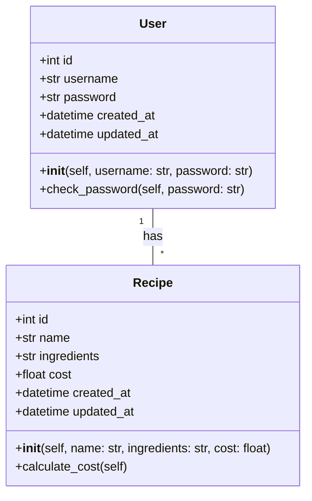
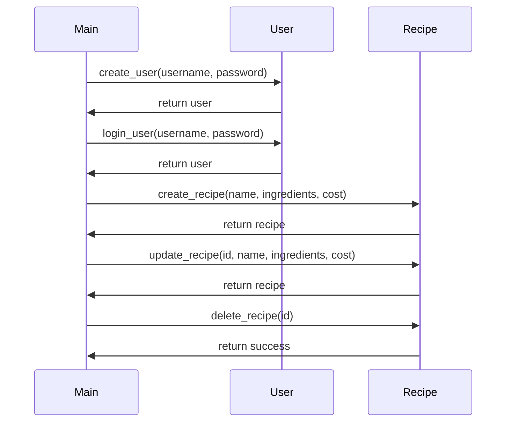

## Implementation approach
We will use Flask, a lightweight WSGI web application framework, to build our web-based application. Flask is easy to use and allows us to develop a robust application with minimal setup. For the front-end, we will use Bootstrap, a popular open-source toolkit for developing with HTML, CSS, and JS. It will help us design a responsive and mobile-friendly interface. We will use SQLAlchemy, an open-source SQL toolkit and ORM, for the database to store the beer recipes. For version control of recipes, we will use Alembic, a database migration tool for SQLAlchemy. For the cost calculation feature, we will write custom Python functions. For the Traditional Chinese interface, we will use Flask-Babel, a Flask extension for i18n and l10n support.

## Python package name
```python
"beer_recipe_app"
```

## File list
```python
[
    "main.py",
    "models.py",
    "forms.py",
    "views.py",
    "config.py",
    "migrations/",
    "templates/",
    "static/"
]
```

## Data structures and interface definitions


## Program call flow


## Anything UNCLEAR
The requirement is clear to me.